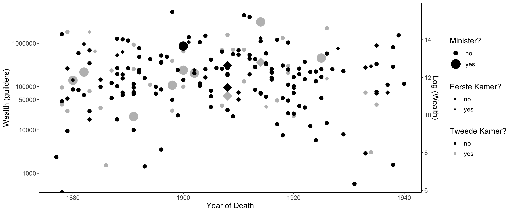

```{r xaringan-themer, include = FALSE, warning = FALSE}
library(xaringanthemer)

style_duo(
    primary_color = "#add8e6", 
    secondary_color = "#3e2f5b",
    header_font_google = google_font("Lato"),
    text_font_google = google_font("Castoro"),
    text_font_size = "1.2em"
    )

#header_font_google = google_font("Josefin Sans"),
#text_font_google   = google_font("Piazzolla"),

```

```{r setup, include=FALSE}
options(htmltools.dir.version = FALSE)

library(kableExtra)
```

class: center, middle, inverse

# Introduction

---

# Introduction

  - In the late nineteenth and early twentieth centuries, the Netherlands transitioned from a **largely autocratic and rent-seeking** society to a **democracy** with a **transparent and competitive** electoral system.
  
  - At the same time, the country witnessed the **Industrial Revolution**, causing more economic growth, a more powerful, more centralized state and an increase in demand for **government intervention**. 
  
      - Seemingly, however, the country's **political elite** did not undergo major changes: the political arena remained rather static in many dimensions. 

      - This study addresses more into depth **the role of politicians** in these developments, by mapping out the **personal wealth** of politicians.
  

---

# Introduction

  - This study finds that, largely consistent with previous empirical studies of demographics of politicians, politicians are wealthy in comparison to the average citizen. 
  
  - Upper house members are by far the wealthiest politicians followed by executives.  Lower house politicians are the poorest on average, consistent with the lower house being accessible by the entire male population of the country.  
  
  - Towards the 1920’s, a substantial number of poorer politicians was elected and politicians of all kinds were significantly less wealthy than their predecessors. 

---

# This presentation

In this **presentation**, I attempt to answer **various questions** of the Dutch political elite. The first aspect I focus on is **differences between politicians of various political affiliations**. 

  - **How wealthy are Dutch politicians?** Can they maintain a living from politics?

  -  Are there large differences between **representative bodies** or **political parties**? 
  
  - **What do their investment portfolios look like?**

  - What is the relationship between their **earnings from politics** and their **return on investments?** Do politicians' investment profiles change over time?
  
---

# This presentation

The second aspect I focus on is differences between politicians of various **representative bodies**. 

  - I contrast politicians in the **lower** and **upper houses**, motivated in part by **electoral restrictions on upper house members** which were **gradually abolished**. 
  
  - What about **central government**? Is there a large contrast between central government and the **parliament**? 
  
  - What happened in **provincial government**? Provincial executive jobs such as _Gedeputeerden_ and _Commissarissen_ frequently served as a precursor to entry in the **national political arena**, but what about those that do not enter national politics?
  
  - **Inequality between politicians**: Did the difference between individual members of parliament increase or decrease over time? 
  
---

class: middle, center, inverse

# Data

---

# Data

- __Memories van Successie__:
  - Probate inventories with the purpose of levying **estate tax**
  - Accurate description of inventory + **appraisal** according to latest share prices
  - Disadvantages: real estate, non-listed assets appraised in an opaque manner
  
- **Political Elite**:
  - Lower house (_Tweede Kamer_) members, Upper house (_Eerste Kamer_) members, _Gedeputeerden_, _Commissarissen_, and _Ministers_
  - Including (sometimes) Minister-President (Eerste Ministers)
  - Finding rate about 75-80%
  - From 1877 (introduction of first all-encompassing **inheritance taxation** to 1917
  - Analysis restricted to politicians who died before 1927, with few exceptions
  
  
---

class: inverse, center, middle

# Wealth and Political Affiliation

---

# Wealth and Political Affiliation

- How wealthy were ** Lower house** members?

.center[

```{r, warning = FALSE, echo = FALSE, message = FALSE, cache = TRUE}
source("./presentation_table_1.R")
knitr::kable(kinds[[1]], digits = 2) %>%
  kable_styling(font_size = 16)
```
  
]

  - Confessional and liberal politicians have a median wealth of approx. **100,000** (1900 deflated) guilders.
  
  - **Socialist** politicians tend to be **poorer**, although the mean is comparable in magnitude to other political affiliations. 
  
  - The 25-th percentile socialist is much less wealthy (3,000 guilders) than the 25-th percentile liberal or confessional politician. 

---

# Wealth and Political Affiliation

- How wealthy were ** Upper house** members?

.center[

```{r, warning = FALSE, echo = FALSE, message = FALSE, cache = TRUE}
knitr::kable(kinds[[2]], digits = 2) %>%
  kable_styling(font_size = 16)
```

]

  - Upper house politicians were on average **much wealthier** than lower house politicians, consistent with **eligibility** restrictions on upper house candidacy. 
  
  - In the upper house, the few **socialist politicians** that were elected are equally wealthy as their **liberal and confessional** counterparts. 

---

# Politicians and the Population

- Using distributional estimates from **De Vicq, van der Valk, Moatsos (WP, 2020)**, we compare politicians to the **general population**.

- The numbers shown below are estimates of the **percentiles** that relate the **distribution of wealth** of politicians to the **distribution of wealth** of the population. 

.pull-left[

- **Lower House**:

```{r, warning = FALSE, message = FALSE, echo = FALSE}
source("./presentation_table_2.R")

knitr::kable(kinds[[1]], digits = 3) %>%
  kable_styling(font_size = 16)
```

]

.pull-right[

- **Upper House**:

```{r, warning = FALSE, message = FALSE, echo = FALSE, cache = TRUE}
knitr::kable(kinds[[2]], digits = 3) %>%
  kable_styling(font_size = 16)

```

]

---

# Party and Wealth over Time

.pull-left[

```{r, warning = FALSE, message = FALSE, echo = FALSE, cache = TRUE}
source("./presentation_figure_1.R")
fig + theme_xaringan()

```

]

.pull-right[

- In the lower house, throughout the entire period, **confessional politicians** are markedly poorer than **liberals**. 

- Up until the **twentieth century**, no significant change in wealth dynamics: members of parliament are, and remain wealthy, in spite of gradual **suffrage extensions**. 

- The upper house shows a much more **volatile pattern**. Only after 1913 the **upper house** became more **representative** of the general population. 

]

---

class: inverse, center, middle

# Wealth and Representative Body

---

# Wealth and Representative Body

.pull-left[

- The late nineteenth and early twentieth century saw **frequent changes** in the political composition of the lower and upper house. 

- At times, **liberals** made up the majority of lower and upper houses, at other times, **confessional political parties and politicians** dominated the political spectrum. 

- In addition, **socialists** made their entry, first in the lower house, then in the upper house.

]

.pull-right[

```{r, warning = FALSE, message = FALSE, echo = FALSE, cache = TRUE}
source("./presentation_figure_2.R")
fig + theme_xaringan()
```

]

---

# Wealth and Representative Body

.pull-left[

```{r, warning = FALSE, message = FALSE, echo = FALSE}
source("./presentation_figure_4.R")
fig + theme_xaringan()

```

]

.pull-right[

- There is a steady **downward trend** in the lower house: the p75, p50 and lower get poorer over time. 
  - In the **upper house**, no such trend exists until roughly 1910. 
  
- The wealthiest MP remain **very wealthy** and even get wealthier after **suffrage extensions** have taken place. 

- At the end of the period, parliamentary wealth has only been a fraction of what it was in the nineteenth century. 

]
---

# Ministers & Governments

```{r, warning = FALSE, message = FALSE, echo = FALSE}
source("./presentation_table_3.R")

table <- table %>%
  mutate(Median = round(Median, 2))

DT::datatable(
  table,
  rownames = FALSE,
  fillContainer = FALSE, 
  options = list(pageLength = 8,
                 initComplete = DT::JS(
        "function(settings, json) {",
        "$(this.api().table().container()).css({'font-size': '70%'});",
        "}"))) %>%
  DT::formatStyle(columns = colnames(table), digits = 2)
```

---

# Inequality between Politicians

- The following tables investigate the **distribution of wealth** per lower house standing: it shows several **percentiles** and an estimated **Gini-coefficient**. 

.pull-left[
```{r, echo = FALSE, message = FALSE, warning = FALSE}
source("./presentation_table_4.R")

knitr::kable(kinds[[1]][1:9,], digits = 2) %>%
  kable_styling(font_size = 12)

```
]


.pull-right[

```{r, echo = FALSE, message = FALSE, warning = FALSE}
knitr::kable(kinds[[1]][10:nrow(kinds[[1]]),], digits = 2) %>%
  kable_styling(font_size = 12)

```

]

<br>

- Apart from the early 1880's, in which parliaments were **wealth but equal**, there seems to have been no **decreasing trend** in parliamentary (in)equality: parliaments remained highly unequal: at all times, there have been very rich and very poor MP's in the **same parliament**. 

---

# The Wealth of Regional Politicians

```{css, echo = FALSE}

.column-left{ float: left; width: 32%; } 

.column-right{ float: right; width: 65% }

```

.column-left[
- **Regional politics** often served as a **stepping stone** to national politics. 
  - The other way around also frequently occured. 

- Regional politicians, like national politicians, are **much wealthier** than the rest of the population. 
  - The average regional politician dies with a net wealth of **about 100,000 guilders**. 
  
]

.column-right[


- There seems to be no relationship between **wealth** and **entry to national politics**. 

]

---

class: inverse, center, middle

# Conclusion

---

# Conclusions

- This study showed that the political elite was **extremely wealthy** in comparison to the average citizen.

- The gap between **politicians and the population they represent** does not appear to decrease over time throughout the 19th century, even in face of suffrage extensions and other measures promoting **better democratic representation**.

- The findings of this paper call for further research into the **discrepancy** between politicians and the electorate:  it is unlikely that the findings of this paper can be **generalized uncritically** to other (Western) European countries. 

- Furthermore, the findings also stress the need for research that investigates the **likely consequences** of this discrepancy. 

---

class: center, middle, inverse

# Thanks for your attention!

Slides created via the R package [**<span style="color:#add8e6">xaringan</span>**](https://github.com/yihui/xaringan).
