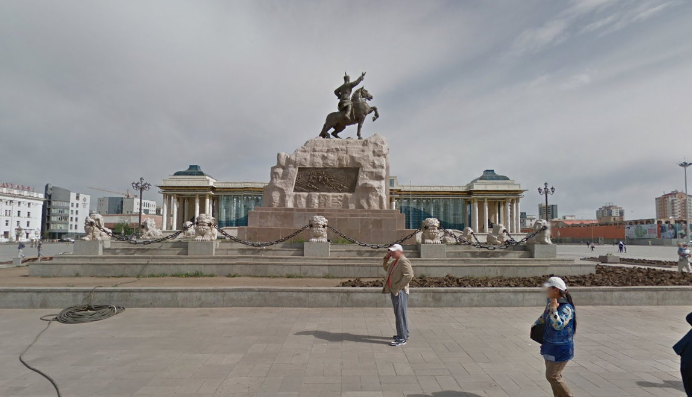
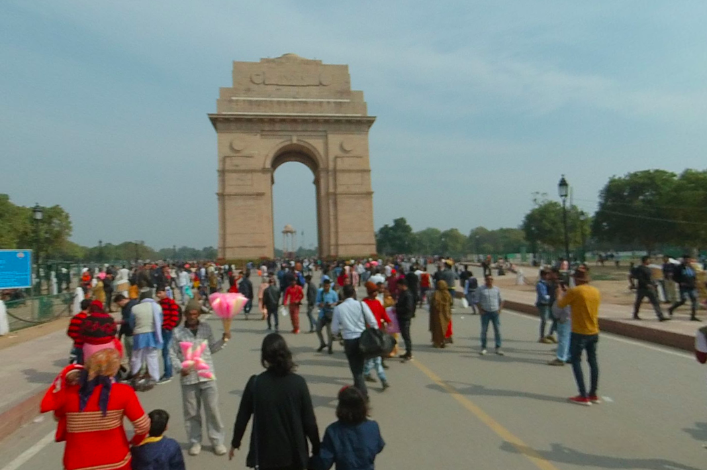
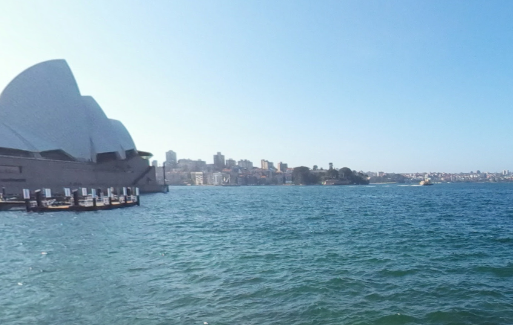
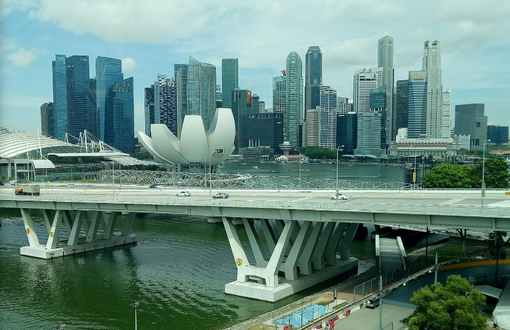
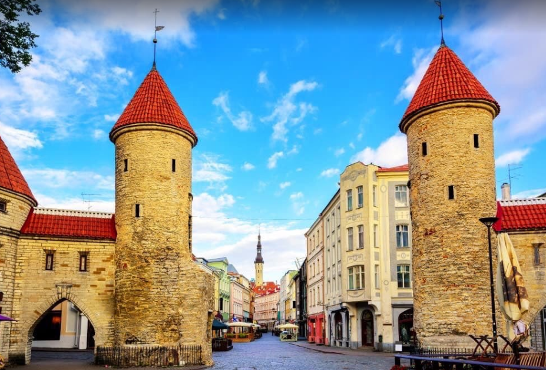
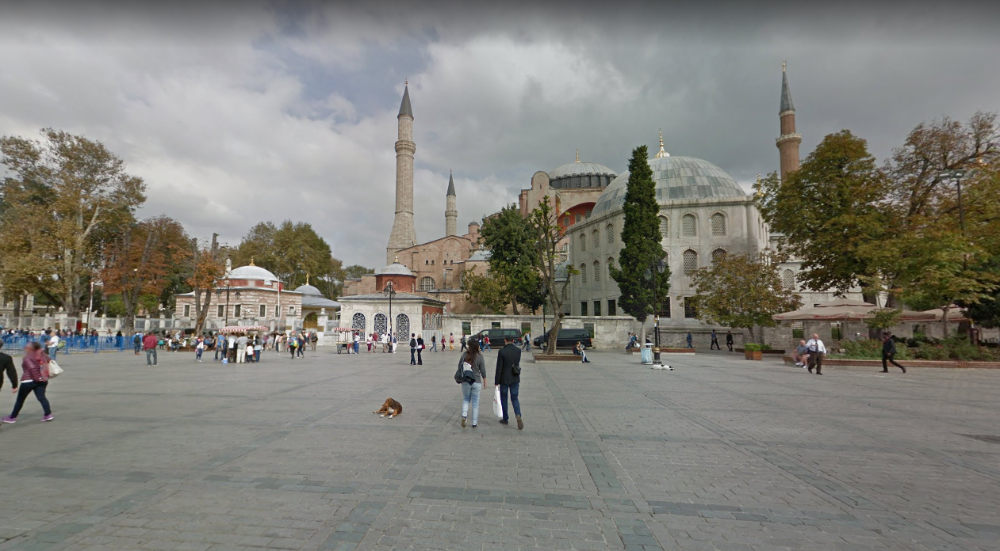
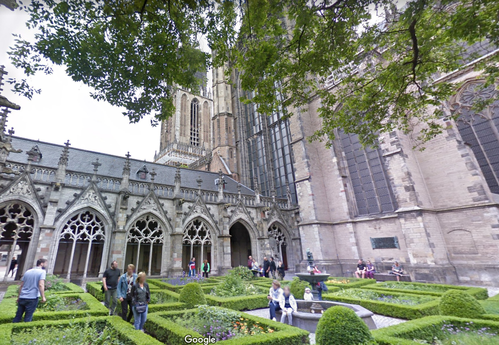

```{r setup, include=FALSE}
options(htmltools.dir.version = FALSE)
```

```{r xaringan-themer, include=FALSE, warning=FALSE}
library(xaringanthemer)
style_mono_accent(
  base_color = "#43418A",
  header_font_google = google_font("Lato"),
  text_font_google   = google_font("Nunito"),
  base_font_size = "20px",
  text_font_size = "25px"
)
```

class: inverse, middle, center

background-image: url(https://i.pinimg.com/originals/3d/49/cb/3d49cbe5d763458a6d592a4580d944fb.jpg)
background-size: 15%

# Pubquiz Holidays: Answers

<br>
<br>
<br>
<br>
<br>

## PhD Council Humanities

### 10 Dec 2020

---

class: inverse

# The Rules

  - Teams have a maximum of 4 members
    - use a separate Teams chat to communicate rather than this channel 
  - No shouting out the correct answers
    - but you can definitely keep on your microphone and make fun of us
  - No life lines: we’re not Who Wants to Be a Millionaire
    - and we could not afford their prize money
  - The quizmaster is always right
    - we’re in the Humanities so there’s no such thing as a ground truth anyways

---

class: inverse

# The Rules

  - Five rounds, one answer form per round
    - Links provided per round
    - Each round features a different theme

  - One team member per team filling out the answer forms

  - Please use the same e-mail address each round!
  
  - If there are multiple "good" (or commonly accepted) answers to a question, we will accept them! :) 

---

class: inverse, center, middle

# Round 1: Quotes

---

# Quotes: Question 1

Who is the author of the following quote?

.center[

  > Everybody is a genius. But if you judge a fish by its ability to climb a tree it will live its whole life believing that it’s stupid.
  
  Albert Einstein
]

---

# Quotes: Question 2


Who is the author of the following quote?

.center[

  > I think, therefore, I am
  
  Rene Descartes
  
]

---

# Quotes: Question 3

Who is the author of the following quote?

.center[

  > I’ll be back 

  Arnold Schwarzenegger (The Terminator)
  
]

---

# Quotes: Question 4

Who is the author of the following quote?

.center[

  > Veni, vidi, vici
  
  Julius Caesar

]

---

# Quotes: Question 5

Who is the author of the following quote?

.center[

  > There is geometry in the humming of the strings, there is music in the spacing of the spheres. 

  Pythagoras
  
]

---

# Quotes: Question 6

Who is the author of the following quote?

.center[

  > What does not kill us makes us stronger

  Friedrich Nietzsche
]  
---

# Quotes: Question 7

Who is the author of the following quote?

.center[

  > To be or not to be, that's the question!
 
 Romeo (William Shakespeare)
 
]

---

# Quotes: Question 8

Who is the author of the following quote?

.center[

  > We are all in the gutter, but some of us are looking at the stars.
  
  Oscar Wilde (Lady Windmere's Fan)
  
]

---

# Quotes: Question 9


Who is the author of the following quote?

.center[

  > You have no control. Who lives, who dies, who tells your story?
  
  Eliza (Hamilton Musical, Lin-Manuel Miranda)

]

---

# Quotes: Question 10

Who is the author of the following quote?

.center[

  > It is a truth universally acknowledged, that a single man in possession of a good fortune, must be in want of a wife.

  Jane Austen (Pride & Prejudice)
  
]

---

class: center, middle, inverse

# Round 2: Happy Holidays Trivia

---

# Happy Holidays: Question 1

.pull-left[

- Who is the patron saint of Utrecht?

- **Saint Martin (of Tours)**

]

.pull-right[


]

---

# Happy Holidays: Question 2

.pull-left[

- When (what day) is his **Feast**?

- November 11

]

.pull-right[


]

---

# Happy Holidays: Question 3

.pull-left[

- On which day is **Chinese New Year** celebrated in **2021**?

- 12 February (Friday)


]

.pull-right[


]
---

<style>

.center2 {
  margin: 0;
  position: absolute;
  top: 50%;
  left: 50%;
  -ms-transform: translate(-50%, -50%);
  transform: translate(-50%, -50%);
}

</style>

# Happy Holidays: Question 4

.center[
- At **what day** do they celebrate **Sinterklaas** in Belgium?

- 6 December


]


---

# Happy Holidays: Question 5

.center[
- What is the **name** of **Sinterklaas's horse?**

- Ozosnel


]

---

# Happy Holidays: Question 6

- What is the **maximum number of visitors** you are allowed to invite for a Christmas dinner?

- Three

.center[

]

---

# Happy Holidays: Question 7

- What does **this** mean?

- Traditional **house blessing** (predominantly in germany)

> https://en.wikipedia.org/wiki/Epiphany_(holiday)

.center[


]

---
# Happy Holidays: Question 8

.pull-left[

- Name 3 ingredients of **Oliebollen**

- (For example)
  - Milk
  - Flour
  - Sugar
  - Egg
  - Raisins
  - Apples
  - Yeast
]

.pull-right[


]
---

# Happy Holidays: Question 9

.pull-left[
- What is the "country" of origin of **Santa Claus**?

- The North Pole 
- Alternatively, Finland
  - More info: https://en.wikipedia.org/wiki/Joulupukki
  
]

.pull-right[


]
---

# Happy Holidays: Question 10

.pull-left[
- How many **reindeer** does **Santa Claus** have?

- Eight: Dasher, Dancer, Prancer, Vixen, Comet, Cupid, Donner, Blitzen, and Rudolph

]

.pull-right[


]

---

class: middle, inverse, center

# Round 3: Guess the country!

Guess the country and the city from the (Google Earth) picture! 

---

# Country/City: Question 1



---
# Country/City: Question 1

- Ulaan-Baatar, Mongolia
---

# Country/City: Question 2



---

# Country/City: Question 2

- New Delhi, India

---

# Country/City: Question 3



---

# Country/City: Question 3

- Sydney, Australia

---

# Country/City: Question 4


---

# Country/City: Question 4

- Singapore, Singapore

---

# Country/City: Question 5


---

# Country/City: Question 5

- Machu Picchu, Peru

---

# Country/City: Question 6


---

# Country/City: Question 6

- Montréal, Canada 

---

# Country/City: Question 7


---

# Country/City: Question 7

- Granada, Spain

---


# Country/City: Question 8



---

# Country/City: Question 8

- Talinn, Estonia

---

# Country/City: Question 9



---

# Country/City: Question 9

- Istanbul, Turkey

---

# Country/City: Question 10


---

# Country/City: Question 10

- Dakar, Sénégal 

---

# Bonus: Question 11



---

# Bonus: Question 11

- Utrecht, Netherlands

---

class: middle, center, inverse

# Round 4: Music!

Name the title and artist (if applicable)

---

# Music: Question 1

- Name the title! :)

<br>
<br>
<br>

.center[
<audio controls>
  <source src="./music/bobby_helms_jingle_bell_rock.mov" />
</audio>

- Jingle Bell Rock
  - Performed by many
  
]

---

# Music: Question 2

- Name the title! :)

<br>
<br>
<br>

.center[
<audio controls>
  <source src="./music/frozen_let_it_go.mov" />
</audio>

- Let it go
  - From 'Frozen'
  
]

---


# Music: Question 3

- Name the title! :)

<br>
<br>
<br>

.center[
<audio controls>
  <source src="./music/hijkomt_hijkomt_delievegoedesint.mov" />
</audio>

- 'Hij komt, hij komt de lieve goede Sint'
  - A Dutch Sinterklaas song
  - Based on Robert Schumann: 
  - _Album für die Jugend, Op. 68: No. 10, Fröhlicher Landmann_
  
]

---


# Music: Question 4

- Name the title and most well-known artist!

<br>
<br>
<br>

.center[
<audio controls>
  <source src="./music/mariah_carey_all_i_want.mov" />
</audio>

- Mariah Carey
- All I Want For Christmas
  - (Is You)
  
]

---


# Music: Question 5

- Name the title and artist!

<br>
<br>
<br>

.center[
<audio controls>
  <source src="./music/nat_king_cole_o_tannenbaum.mov" />
</audio>

  - _O Tannenbaum, (O Dennenboom, O Christmas Tree)_
  - This version: Nat King Cole
]

---


# Music: Question 6

- Name the title and artist!

<br>
<br>
<br>

.center[
<audio controls>
  <source src="./music/pavarotti_adeste_fidelis.mov" />
</audio>

- Adeste Fideles (O Come All Ye Faithful, Komt Allen Tezamen)
- This version: Luciano Pavarotti

]

---


# Music: Question 7

- Name the title! :)

<br>
<br>
<br>

.center[
<audio controls>
  <source src="./music/rudolf_red_nosed_reindeer.mov" />
</audio>

- Rudolf The Red-Nosed Reindeer

]

---

# Music: Question 8

- Name the title and composer

<br>
<br>
<br>

.center[
<audio controls>
  <source src="./music/vivaldi_winter_1stmov.mov" />
</audio>

- Antonio Vivaldi
- _Winter_ from the _Quatro Staggioni_
  - 1st movement
  
]

---

# Music: Question 9

- Name the title and artist

<br>
<br>
<br>

.center[
<audio controls>
  <source src="./music/wham_last_christmas.mov" />
</audio>

- Wham (George Michael)
- Last Christmas

]

---

# Music: Question 10

- Name the title!

<br>
<br>
<br>

.center[
<audio controls>
  <source src="./music/wilhelmus.mov" />
</audio>

- Wilhelmus van Nassouwe
- Dutch national anthem

]

---

class: inverse, middle, center

# Round 5: Movies and languages

Guess the movie and the language in which it is synchronized!

---

# Movies: Question 1

.center[
 <video width="320" height="240" controls>
  <source src="./films/elf_espanol.mp4" type="video/mp4">
Your browser does not support the video tag.
</video> 

- Elf
- Spanish
]

---

# Movies: Question 2

.center[

 <video width="320" height="240" controls>
  <source src="./films/harrypotter_steinderweisen_deutsch.mp4" type="video/mp4">
Your browser does not support the video tag.
</video> 

- Harry Potter (Und der Stein der Weisen)
- German

]

---

# Movies: Question 3

.center[

 <video width="320" height="240" controls>
  <source src="./films/lotr_hindi_good.mp4" type="video/mp4">
Your browser does not support the video tag.
</video> 

- Lord of the Rings (The Fellowship of the Ring)
- Hindi

]


---

# Movies: Question 4

.center[

 <video width="320" height="240" controls>
  <source src="./films/lion_king_good.mp4" type="video/mp4">
Your browser does not support the video tag.
</video> 

- The Lion King
- Hebrew

]

---

# Movies: Question 5

.center[

 <video width="320" height="240" controls>
  <source src="./films/home_alone_francais.mp4" type="video/mp4">
Your browser does not support the video tag.
</video> 

- Home Alone 
- French

]

---

# Movies: Question 6

.center[

 <video width="320" height="240" controls>
  <source src="./films/the_grinch_turkce.mp4" type="video/mp4">
Your browser does not support the video tag.
</video> 

- The Grinch
- Turkish

]

---
class: middle, center

# Thank you for joining!

Slides created via the R package [**xaringan**](https://github.com/yihui/xaringan).
